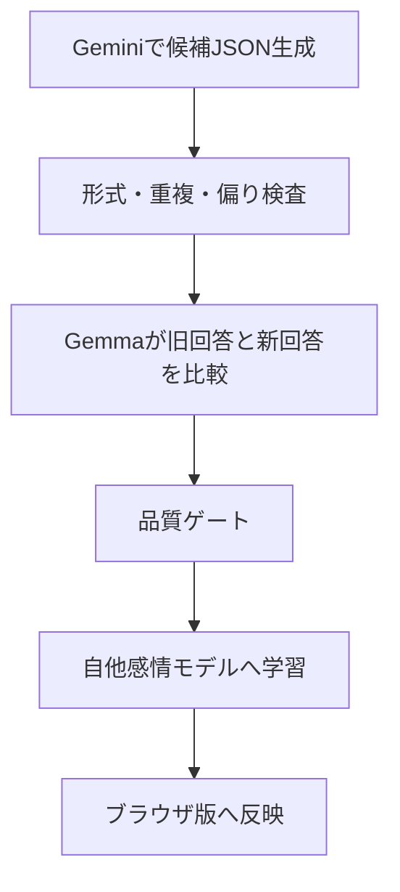

---
tags:
  - ryna
  - learning
  - gemma
  - gemini
status: active
updated: 2026-05-26
---

# 学習とデータ運用

## 教材形式

現在の教材は、らいなの感情と相手の推定感情を両方持つ。

```json
{
  "input": "今日は仕事で疲れた",
  "self_zone": "楽",
  "user_zone": "哀",
  "response": "ゆっくり 休んで ね",
  "response_zone": "哀"
}
```

| 項目 | 意味 |
| --- | --- |
| `input` | 相手が話す文 |
| `self_zone` | その時のらいなの気分 |
| `user_zone` | 入力から想定する相手の気分 |
| `response` | らいなの返答。単語を空白区切りで保存 |
| `response_zone` | 返答に現れる主な感情 |

## データを増やす流れ



### 1. Gemini

大量の候補教材を作る担当。現在は160件単位で、
16組み合わせを各10件ずつ作る運用が扱いやすい。

### 2. Gemma教師

ローカルの `gemma4:e2b` を使い、候補をそのまま全採用せず比較する。

- 同じ `input / self_zone / user_zone` がある場合は、既存回答と候補回答のよい方を選ぶ
- 新しい条件なら、教材として採用するか判断する
- 必要なら返答を修正する

### 3. 品質ゲート

Gemmaも誤って壊れた文や過剰な候補を通すことがあるため、
最後にPython側で形式と一部の問題表現を検査してから公開版へ出す。

> [!note] 人格方針との関係
> らいなは重く荒い感情表現も育てる方針になった。
> そのため、今後の品質基準は「怒りの言葉を全部消す」ではなく、
> 人格として残す激情と、会話を壊す返答を区別する方向で見直す余地がある。

## 現在の学習状態

| 項目 | 数 |
| --- | ---: |
| 採用済み教材 | 727件 |
| 感情組み合わせ | 16通り |
| `response_zone=楽` | 238件 |
| `response_zone=哀` | 173件 |
| `response_zone=喜` | 167件 |
| `response_zone=怒` | 149件 |

現在は `楽` の返答が最多だが、今回の重い人格教材によって
`怒` と `哀` も大きく増え、らいならしい振れ幅が強くなっている。

## 実行コマンド

### JSONの検査

```powershell
python dual_emotion_learning\dual_cli.py validate "gemini用新\候補.json"
```

### 既存回答とのGemma比較、全件処理して反映

```powershell
python dual_emotion_learning\teacher_cli.py incorporate --candidate "gemini用新\候補.json" --batch-size 10 --loop --publish
```

### 品質ゲートを通して再構築・再公開

```powershell
python dual_emotion_learning\teacher_cli.py rebuild-incorporated --publish
```

## 未知語探索

語彙を闇雲に増やすのではなく、Gemmaに日常発話を作らせ、
現在の教材にない具体的な話題語だけを集める機能を追加済み。

```powershell
python vocabulary_explorer\explorer_cli.py collect --count 10
python vocabulary_explorer\explorer_cli.py loop --count 10
python vocabulary_explorer\explorer_cli.py status
python vocabulary_explorer\explorer_cli.py export-prompt --limit 50
```

未知語はそのまま感情辞書へ突っ込まず、
Geminiにその話題を含む会話教材を作らせる材料として使う。

## データの場所

| 場所 | 内容 |
| --- | --- |
| `gemini用新/` | 生成された候補JSON |
| `dual_emotion_learning/training_data.json` | 現在採用されている自他感情教材 |
| `dual_emotion_learning/incorporation_runs.json` | Gemmaの比較判断履歴 |
| `dual_emotion_learning/dual_model.json` | ブラウザ返答用の16条件モデル |
| `vocabulary_explorer/` | 未知語収集 |
| `archive/legacy_learning_20260526/` | 旧方式の隔離データ |

## 関連

- [[02 現在の仕組み]]
- [[04 現在地と次にやること]]
