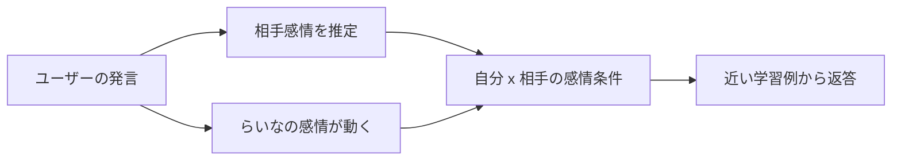

---
aliases:
  - Home
  - RynaAI
tags:
  - ryna
  - project/home
status: active
updated: 2026-05-26
---

# RynaAI / らいな

> [!abstract] このプロジェクト
> **感情を返答の飾りではなく、会話の選択条件そのものとして持つ軽量AI**を作る実験。
> 実行時にLLMを使わず、ブラウザだけでも動く「らいな」を育てている。

## 入口

- [[01 目的と人格|なぜ作るのか / らいなの人格]]
- [[02 現在の仕組み|感情・返答・ブラウザ版の仕組み]]
- [[03 学習とデータ運用|JSON生成、Gemma審査、未知語探索]]
- [[04 現在地と次にやること|現在の成果とロードマップ]]

## 一言でいうと

らいなは、自分にも相手にも `喜 / 怒 / 哀 / 楽` の感情状態を置き、
その組み合わせに応じて学習済みの返答を選ぶ、小さな会話AI。

## 現在のスナップショット

| 項目 | 状態 |
| --- | --- |
| 名前 | ryna / らいな |
| 会話教材 | 727件採用済み |
| 感情条件 | `self_zone x user_zone` の16組み合わせ |
| 公開版 | `web_chat/` の静的HTML/JavaScript |
| 教師 | ローカルOllamaの `gemma4:e2b` |
| 教材生成候補 | GeminiでJSONを生成し、Gemmaで比較審査 |
| 新しい実験 | Gemma会話から未知の話題語を発見する機能 |

## 関連メモ

- [[設計メモ - Gemma回数表方式と相手感情の実装方針|過去の設計検討メモ]]

> [!warning] メモの読み方
> 過去の設計メモには、当時「未実装」だった機能の記述もある。
> 現在の正しい状況は、このホームと [[02 現在の仕組み]] を基準にする。
